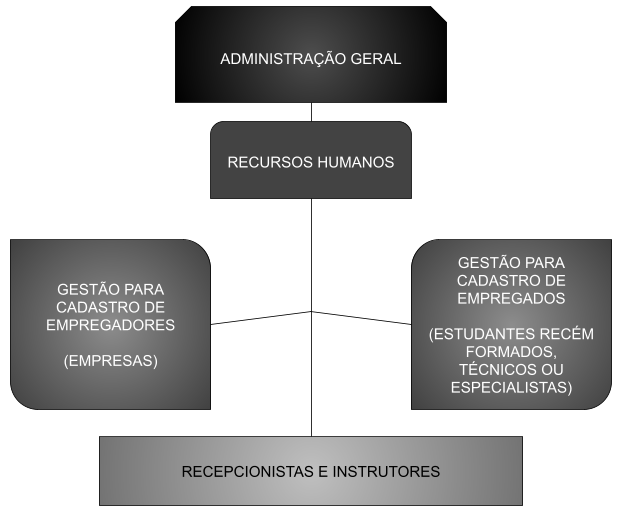

# organograma-consultoria

    detalhes e disposição da organização da empresa

## Objectivo geral

1. `Apoiar a comunidade juvenil e instituições encontrando soluções para os seus problemas (econômicos e/ou técnicos)`

**Alvo 1: `Jovens licenciados ou técnicos desempregados, procurando oportunidades de trabalho ou para apresentarem os seus projetos ao mundo`**. \
**Alvo 2: `Empresas solicitando resolução para os problemas técnicos ou administrativos em suas instituições`**.

## Objectivos específicos - Atuação

O nosso trabalho será de avaliar as `aptidões` dos concorrentes que submeterem os seus dados e fazer a sugestão aos `representantes das instituições` carentes 
**(segundo os requisitos apresentados por eles)**.

`Orientar e introduzir o melhor modo de utilização` das ferramentas tecnológicas disponíveis para a resolução daquele problema, 
e por conseguinte uma pequena **introdução do trabalho** que será feito pelo técnico
**(se possível uma breve apresentação de prévios trabalhos ou projetos ou feedbacks possuídos pelo técnico)**.

E finalmente agendar-se-á o `encontro entre os empregadores e o técnico` para decidir se haverá uma **contratação (permanente, temporária ou casual)**, 
com um `estágio prévio para se avaliar a experiência do técnico`.
